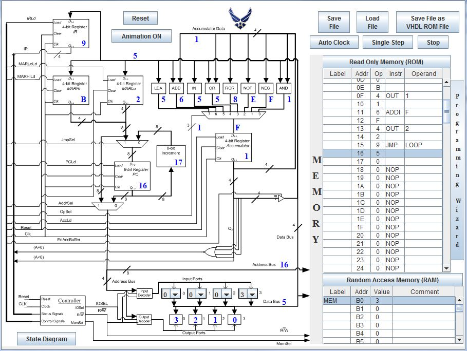
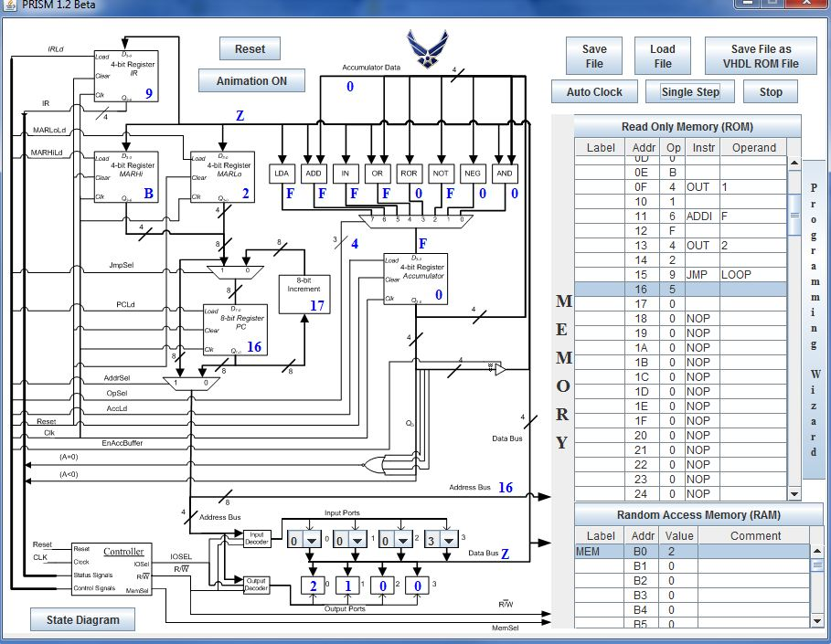
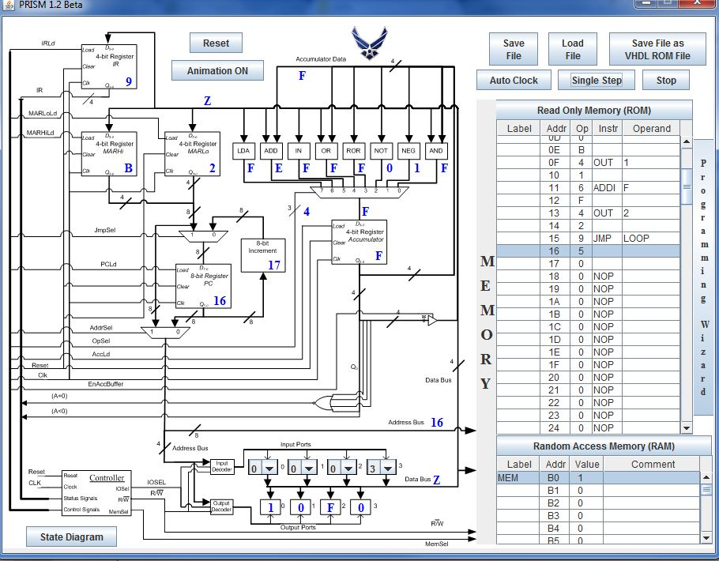

ECE281_CE4
==========

Basic PRISM operations dealing with memory, data manipulation, and loops

##Memory

Memory is a simple program that writes values to certain locations in memory. It serves as a simple
example of using memory in assembly. It was accomplished by using the LDAI opcode to load the value 
onto the accumulator. Then, using the STA command, the values was written to the desired location in 
memory. It's important to note that you must use labels to mark the locations in memory and then passing
that label to the STA opcode. 

##Math

Math doubled a value from memory and then subtracted four from it. To double the value I first loaded it
onto the accumulator using LDAD then I added it to itself using ADDD. Finally I subtracted four by adding
a negative four to the number using ADDI. It is important to note on this one that you need to use
2's complement to add a negative four as PRISM has no subtract functionality in and of itself. 

##Loop

Loop was the more difficult program of the three to write. It required that a value be read from input and
written to output 0, one less than the value to output 1, and one less than that to output 2. It would then
loop through the three outputs subtracting one from each everytime. To accomplish this I loaded the input
into a memory location using IN to put it on the accumulator, and then STA to transfer it to MEM. Then I 
created my loop. I displayed the value on the accumulator to output 0, subtract one, display the value on 
the accumulator to output 1 and also write it to MEM, and finally subtracting one more from the accumulator
and displaying that on output 2. Rinse and repeat. 

###Loop Test Screen Captures

First iteration

Second iteration

Third iteration

As you can see, the loop decrements each counter and "rolls back" when you get to 0. 
